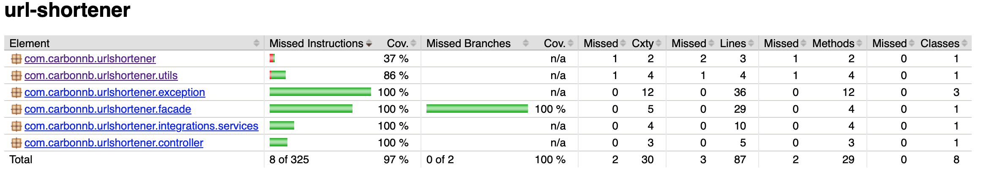

# Url Shortener

The Url shortener is deployed on Heroku so it is accessible at : [Url shortener UI](https://urlshortener-ui-1c6938ccabc0.herokuapp.com/).

It's on Eco mode on Heroku so on the first connection the server needs to launch so it could take some time for the first shorten Url.

## Documentation

You will find documentation for the React application and the Spring boot application in their own Readme :
* [Url shortener UI](https://github.com/BastienCarbonnier/url-shortener-ui)
* [Url shortener API](https://github.com/BastienCarbonnier/url-shortener-api)

## Launching application

To launch latest backend and frontend images and a postgresql database you can use the docker-compose file present in docker folder.

```bash
docker compose -f docker/url-shortener.yaml -p "url-shortener" up
```

You can access this application at http://localhost:3001

## Testing

### Frontend

Use of Cypress library.

To launch the test you need first to go in 'url-shortener-ui' directory and launch the application with this command :

```bash
docker compose -f cypress/docker/url-shortener.yaml -p "url-shortener-cy" up
```

And then run : 
```bash
npm run cy:run-e2e
```

### Backend

Use of test containers for integration test and mockito for unit tests.

You can launch the tests with the command : 
```bash
./gradlew test
```

One idea of improvement could be to add more test to check exceptions. I added Jacoco plugin to calculate coverage for backend and now I have a couverture of 97%. 


## Idea of improvement
* Encrypt the full url saved in database
* Adding statistics view in frontend